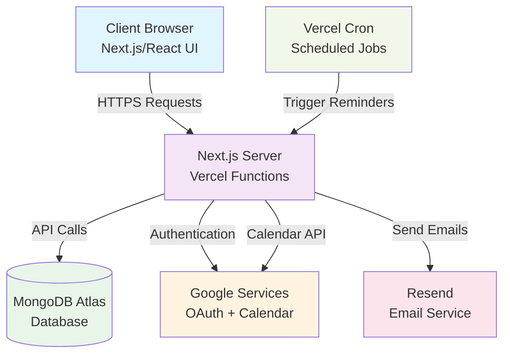

#  Next.js Smart Scheduler with Google Calendar Integration

<div align="center">
  
  
  
  
  
  
</div>

<br />

<div align="center">
  <h3>A comprehensive, full-stack scheduling platform that seamlessly connects service providers (Sellers) with clients (Buyers)</h3>
  <p>Deep integration with Google Calendar • Automatic Google Meet links • Email notifications • Analytics dashboard</p>
</div>

---

## 📸 Application Screenshots

<div align="center">
  <table>
    <tr>
      <td align="center">
        
        <br /><strong>Seller Analytics Dashboard</strong>
      </td>
      <td align="center">
        
        <br /><strong>Buyer Seller Browser</strong>
      </td>
    </tr>
    <tr>
      <td align="center">
        
        <br /><strong>Interactive Booking Interface</strong>
      </td>
      <td align="center">
        
        <br /><strong>Appointments Management</strong>
      </td>
    </tr>
  </table>
</div>

---

## ✨ Core Features

### 🔐 **Secure Authentication System**
- **Google OAuth Integration**: Seamless sign-in with Google accounts via NextAuth.js
- **JWT Session Management**: Robust token-based authentication
- **Role-Based Access Control**: Dual role system (Seller/Buyer) with tailored experiences

### 👥 **Intelligent User Management**
- **Role Selection Flow**: New users choose their role after first login
- **Profile Management**: Users can update preferences and settings
- **Session Persistence**: Secure session management across browser sessions

### ⚙️ **Advanced Seller Controls**
- **Availability Management**: Set working hours, days, and buffer times
- **Calendar Integration**: Real-time sync with personal Google Calendar
- **Conflict Prevention**: Automatic blocking of busy time slots
- **Flexible Scheduling**: Customizable appointment durations and gaps

### 🧠 **Real-Time Scheduling Engine**
The core scheduling system intelligently calculates availability by:
- 📊 Fetching seller's predefined working hours from database
- 📅 Connecting to live Google Calendar to identify busy slots
- ⚡ Real-time availability calculation and display
- 🚫 Automatic conflict detection and prevention

### 📅 **Seamless Booking & Calendar Integration**
- **One-Click Booking**: Simple, intuitive booking process for buyers
- **Automatic Calendar Events**: Events created on both parties' Google Calendars
- **Smart Invitations**: Buyers automatically invited to seller's calendar events
- **Sync Reliability**: Two-way calendar synchronization

### 📹 **Automatic Google Meet Integration**
- **Auto-Generated Links**: Unique Google Meet room for every appointment
- **Calendar Embedding**: Meet links embedded in calendar events
- **One-Click Join**: Direct access from appointment cards and emails
- **Professional Experience**: Enterprise-grade video conferencing

### 📧 **Professional Email Notification System**
- **Instant Confirmations**: HTML-formatted emails sent immediately upon booking
- **Cancellation Alerts**: Automatic notifications when appointments are cancelled
- **Smart Reminders**: Automated emails at 60 and 30 minutes before appointments
- **Professional Templates**: Branded, responsive email designs

### 📊 **Comprehensive Seller Analytics**
- **Booking Trends**: Visual charts showing booking patterns over time
- **Popular Time Slots**: Bar charts displaying most requested hours
- **Conversion Metrics**: View-to-booking conversion rates
- **Performance Insights**: Data-driven insights for optimization

### ✅ **Complete Booking Lifecycle Management**
- **Appointment Dashboard**: View all upcoming and past appointments
- **Easy Cancellation**: One-click cancellation with automatic notifications
- **Status Tracking**: Real-time booking status updates
- **History Management**: Complete appointment history and records

---

## 🏗️ System Architecture



### **Architecture Highlights:**
- **Serverless Functions**: Scalable API routes via Vercel
- **Database**: MongoDB Atlas with Mongoose ODM
- **Real-time Sync**: Live Google Calendar integration
- **Automated Tasks**: Cron jobs for reminder system
- **Modern Frontend**: React with TypeScript and Tailwind CSS

---

## 🛠️ Tech Stack

<table>
<tr>
<td valign="top">

### **Frontend**
- **Framework**: Next.js 14+ (App Router)
- **Language**: TypeScript
- **Styling**: Tailwind CSS
- **Components**: shadcn/ui
- **Charts**: Recharts
- **Forms**: React Hook Form + Zod
- **State**: React Hooks + Context

</td>
<td valign="top">

### **Backend**
- **Runtime**: Node.js (Vercel Functions)
- **Authentication**: NextAuth.js
- **Database**: MongoDB Atlas
- **ODM**: Mongoose
- **Validation**: Zod schemas
- **Security**: JWT + Encryption

</td>
</tr>
<tr>
<td valign="top">

### **Services & APIs**
- **Authentication**: Google OAuth 2.0
- **Calendar**: Google Calendar API
- **Email**: Resend API
- **Scheduling**: Vercel Cron Jobs
- **Hosting**: Vercel Platform

</td>
<td valign="top">

### **DevOps & Tools**
- **Deployment**: Vercel
- **Environment**: dotenv
- **Linting**: ESLint + Prettier
- **Git Hooks**: Husky
- **Package Manager**: npm

</td>
</tr>
</table>

---

## 📁 Project Structure

```
/src
├── 📁 app/                     # Next.js App Router
│   ├── 📁 api/                 # Backend API routes
│   │   ├── 📁 auth/            # NextAuth.js handlers
│   │   ├── 📁 bookings/        # Booking CRUD operations
│   │   ├── 📁 sellers/         # Seller management
│   │   ├── 📁 analytics/       # Analytics endpoints
│   │   └── 📁 cron/           # Scheduled job handlers
│   ├── 📁 dashboard/           # Dashboard pages
│   ├── 📁 book/               # Booking interface
│   ├── 📁 appointments/        # Appointments view
│   ├── layout.tsx             # Root layout
│   └── page.tsx               # Landing page
├── 📁 components/              # React components
│   ├── 📁 ui/                 # shadcn/ui components
│   ├── 📁 auth/               # Authentication components
│   ├── 📁 buyer/              # Buyer-specific components
│   ├── 📁 seller/             # Seller-specific components
│   └── 📁 shared/             # Reusable components
├── 📁 lib/                     # Core services
│   ├── mongodb.ts             # Database connection
│   ├── google-calendar.ts     # Calendar service
│   ├── email-service.ts       # Email service
│   └── analytics-service.ts   # Analytics service
├── 📁 types/                   # TypeScript definitions
└── 📁 hooks/                   # Custom React hooks
```

---

## 🚀 Quick Start Guide

### **Prerequisites**
- Node.js 18+ 
- MongoDB Atlas account
- Google Cloud Platform account
- Resend account (for emails)

### **1. Clone Repository**
```bash
git clone https://github.com/your-username/nextjs-smart-scheduler.git
cd nextjs-smart-scheduler
```

### **2. Install Dependencies**
```bash
npm install
```

### **3. Environment Setup**
Create `.env.local` in project root:

```env
# Database Configuration
MONGODB_URI="your_mongodb_atlas_connection_string"
DATABASE_NAME="scheduler_db"

# Google OAuth & Calendar API
GOOGLE_CLIENT_ID="your_google_oauth_client_id"
GOOGLE_CLIENT_SECRET="your_google_oauth_client_secret"
NEXTAUTH_SECRET="generate_random_secret_32_chars"
NEXTAUTH_URL="http://localhost:3000"

# Email Service (Resend)
RESEND_API_KEY="your_resend_api_key"
FROM_EMAIL="noreply@yourdomain.com"

# Security
ENCRYPTION_KEY="your_32_character_encryption_key"

# Cron Jobs (Production)
CRON_SECRET="your_cron_secret_token"
```

### **4. Google Cloud Setup**
1. Create project in [Google Cloud Console](https://console.cloud.google.com/)
2. Enable Google Calendar API
3. Create OAuth 2.0 credentials
4. Add redirect URI: `http://localhost:3000/api/auth/callback/google`

### **5. Database Setup**
1. Create MongoDB Atlas cluster
2. Get connection string
3. Database collections will be created automatically

### **6. Run Development Server**
```bash
npm run dev
```

🎉 **Application running at**: `http://localhost:3000`

---

## 📖 Detailed Setup Instructions

<details>
<summary><strong>🗄️ MongoDB Atlas Configuration</strong></summary>

1. **Create Account**: Sign up at [MongoDB Atlas](https://www.mongodb.com/cloud/atlas)
2. **Create Cluster**: 
   - Choose free tier (M0)
   - Select region closest to your users
   - Create cluster name
3. **Database Access**:
   - Create database user with read/write permissions
   - Note username and password
4. **Network Access**:
   - Add IP address (0.0.0.0/0 for development)
   - For production, restrict to specific IPs
5. **Connection String**:
   - Click "Connect" → "Connect your application"
   - Copy connection string
   - Replace `<password>` with your database user password

</details>

<details>
<summary><strong>🔑 Google Cloud Platform Setup</strong></summary>

1. **Create Project**:
   ```
   - Go to Google Cloud Console
   - Create new project or select existing
   - Note project ID
   ```

2. **Enable APIs**:
   ```
   - Google Calendar API
   - Google+ API (for OAuth)
   ```

3. **Create OAuth Credentials**:
   ```
   - Go to "Credentials" → "Create Credentials" → "OAuth 2.0 Client ID"
   - Application type: Web application
   - Authorized redirect URIs:
     - http://localhost:3000/api/auth/callback/google (development)
     - https://yourdomain.com/api/auth/callback/google (production)
   ```

4. **Required Scopes**:
   ```
   - openid
   - email  
   - profile
   - https://www.googleapis.com/auth/calendar.events
   - https://www.googleapis.com/auth/calendar.readonly
   ```

</details>

<details>
<summary><strong>📧 Resend Email Setup</strong></summary>

1. **Create Account**: Sign up at [Resend](https://resend.com/)
2. **Get API Key**:
   - Go to API Keys section
   - Create new API key
   - Copy the key (starts with `re_`)
3. **Domain Setup** (Production):
   - Add your domain
   - Verify DNS records
   - For development, use `onboarding@resend.dev`

</details>

---

## 🔧 Configuration Guide

### **Environment Variables Explained**

| Variable | Description | Required |
|----------|-------------|----------|
| `MONGODB_URI` | MongoDB Atlas connection string | ✅ |
| `DATABASE_NAME` | Database name (e.g., "scheduler_db") | ✅ |
| `GOOGLE_CLIENT_ID` | Google OAuth client ID | ✅ |
| `GOOGLE_CLIENT_SECRET` | Google OAuth client secret | ✅ |
| `NEXTAUTH_SECRET` | NextAuth.js secret key (32+ chars) | ✅ |
| `NEXTAUTH_URL` | Base URL of your application | ✅ |
| `RESEND_API_KEY` | Resend email service API key | ✅ |
| `FROM_EMAIL` | Sender email address | ✅ |
| `ENCRYPTION_KEY` | 32-character key for token encryption | ✅ |
| `CRON_SECRET` | Secret for cron job authentication | 🔧 |

### **Generate Secure Secrets**
```bash
# Generate NEXTAUTH_SECRET (32 characters)
openssl rand -base64 32

# Generate ENCRYPTION_KEY (32 characters)
openssl rand -hex 16
```

---

## 📋 API Documentation

<details>
<summary><strong>🔗 API Endpoints</strong></summary>

### **Authentication**
- `GET /api/auth/session` - Get current session
- `POST /api/auth/signin` - Sign in with provider
- `POST /api/auth/signout` - Sign out user
- `POST /api/auth/setup-role` - Set user role (seller/buyer)

### **User Management**
- `GET /api/users/me` - Get current user profile
- `PUT /api/users/preferences` - Update user preferences

### **Sellers**
- `GET /api/sellers` - List all sellers (for buyers)
- `GET /api/sellers/[id]` - Get seller details
- `GET /api/sellers/[id]/availability` - Get seller availability

### **Bookings**
- `GET /api/bookings` - Get user bookings
- `POST /api/bookings` - Create new booking
- `PUT /api/bookings/[id]` - Update booking status
- `DELETE /api/bookings/[id]` - Cancel booking

### **Analytics**
- `GET /api/analytics/seller/[id]` - Get seller analytics
- `POST /api/analytics/track` - Track analytics event

### **Scheduled Jobs**
- `POST /api/cron/send-reminders` - Send appointment reminders

</details>

---

## 🧪 Testing Guide

### **Local Testing**
```bash
# Run development server
npm run dev

# Run type checking
npm run type-check

# Run linting
npm run lint

# Run build test
npm run build
```

### **Test Accounts Setup**
1. **Create test Google accounts**:
   - One for seller testing
   - One for buyer testing
2. **Test email delivery**:
   - Use your personal email for testing
   - Verify booking confirmations arrive
3. **Test calendar integration**:
   - Book appointment
   - Verify events appear in Google Calendar
   - Test Google Meet links

---

## 🚢 Deployment Guide

### **Deploy to Vercel**

1. **Connect Repository**:
   ```bash
   # Install Vercel CLI
   npm i -g vercel
   
   # Deploy
   vercel
   ```

2. **Configure Environment Variables**:
   - Go to Vercel Dashboard → Project → Settings → Environment Variables
   - Add all environment variables from `.env.local`
   - Update `NEXTAUTH_URL` to your production domain

3. **Update Google OAuth**:
   - Add production redirect URI in Google Cloud Console
   - Format: `https://yourdomain.com/api/auth/callback/google`

4. **Configure Cron Jobs**:
   ```json
   // vercel.json
   {
     "crons": [
       {
         "path": "/api/cron/send-reminders",
         "schedule": "*/15 * * * *"
       }
     ]
   }
   ```

5. **Domain Setup**:
   - Configure custom domain in Vercel
   - Update `NEXTAUTH_URL` environment variable
   - Update Google OAuth redirect URIs

---

## 📊 Monitoring & Analytics

### **Application Metrics**
- **User Registrations**: Track new seller/buyer signups
- **Booking Volume**: Monitor daily/weekly booking trends  
- **Email Delivery**: Track confirmation and reminder email success rates
- **Calendar Sync**: Monitor Google Calendar API success rates

### **Error Monitoring**
- **API Errors**: Track failed API requests
- **Authentication Failures**: Monitor OAuth failures
- **Calendar Sync Issues**: Track Google Calendar API errors
- **Email Failures**: Monitor failed email deliveries

---

## 🛡️ Security Considerations

### **Data Protection**
- ✅ **Encryption**: Sensitive tokens encrypted at rest
- ✅ **JWT Security**: Secure session management
- ✅ **Environment Variables**: Sensitive data in environment variables
- ✅ **HTTPS Only**: Force HTTPS in production

### **API Security**
- ✅ **Rate Limiting**: Prevent API abuse
- ✅ **Input Validation**: Zod schema validation
- ✅ **CORS Configuration**: Proper cross-origin settings
- ✅ **Error Handling**: No sensitive data in error responses

### **OAuth Security**
- ✅ **Scope Limitation**: Request only necessary permissions
- ✅ **Token Refresh**: Automatic token renewal
- ✅ **Secure Storage**: Encrypted refresh token storage

---

## 🤝 Contributing

### **Development Workflow**
1. Fork the repository
2. Create feature branch (`git checkout -b feature/amazing-feature`)
3. Make changes with proper TypeScript types
4. Test thoroughly (manual testing + type checking)
5. Commit changes (`git commit -m 'Add amazing feature'`)
6. Push to branch (`git push origin feature/amazing-feature`)
7. Open Pull Request

### **Code Standards**
- **TypeScript**: Strict type checking enabled
- **ESLint**: Follow configured linting rules
- **Prettier**: Consistent code formatting
- **Naming**: Descriptive variable and function names
- **Comments**: Document complex business logic

### **Commit Guidelines**
```
feat: add new feature
fix: bug fix
docs: update documentation
style: formatting changes
refactor: code refactoring
test: add tests
chore: maintenance tasks
```

---

## 🐛 Troubleshooting

<details>
<summary><strong>Common Issues & Solutions</strong></summary>

### **Google OAuth Issues**
- **Problem**: "Redirect URI mismatch"
- **Solution**: Verify redirect URI in Google Cloud Console matches exactly

### **Database Connection Issues**
- **Problem**: "MongoNetworkError"
- **Solution**: Check IP allowlist in MongoDB Atlas, verify connection string

### **Email Not Sending**
- **Problem**: Emails not received
- **Solution**: Verify Resend API key, check FROM_EMAIL domain verification

### **Calendar Events Not Creating**
- **Problem**: Events not appearing in Google Calendar
- **Solution**: Check Google Calendar API permissions, verify scopes in OAuth

### **Cron Jobs Not Running**
- **Problem**: Reminders not being sent
- **Solution**: Verify vercel.json cron configuration, check CRON_SECRET

</details>

---

## 📈 Roadmap

### **Planned Features**
- [ ] **SMS Notifications**: Text message reminders via Twilio
- [ ] **Payment Integration**: Stripe integration for paid appointments
- [ ] **Multi-timezone Support**: Advanced timezone handling
- [ ] **Recurring Appointments**: Support for repeating bookings
- [ ] **Team Scheduling**: Multi-seller team management
- [ ] **Mobile App**: React Native mobile application
- [ ] **Advanced Analytics**: More detailed reporting and insights
- [ ] **API Rate Limiting**: Advanced rate limiting implementation
- [ ] **Webhooks**: Real-time event notifications
- [ ] **Custom Branding**: White-label solution for businesses

### **Technical Improvements**
- [ ] **Unit Tests**: Comprehensive test coverage
- [ ] **E2E Tests**: Automated browser testing
- [ ] **Performance Optimization**: Bundle size reduction
- [ ] **Accessibility**: WCAG 2.1 AA compliance
- [ ] **PWA Features**: Progressive Web App capabilities

---

## 📄 License

This project is licensed under the MIT License. See the [LICENSE](LICENSE) file for details.

---

<div align="center">
  <p>Made with ❤️ by the Smart Scheduler Team</p>
  <p>
    <a href="#top">Back to Top ⬆️</a>
  </p>
</div>
